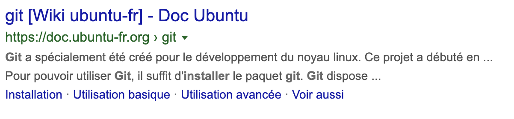
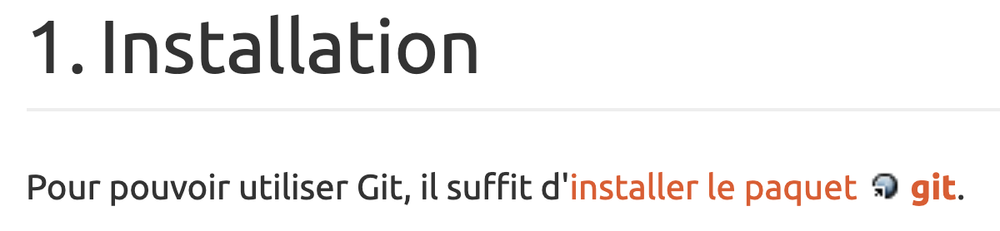

# Install Packets/Libraries

Depending on your OS, you will have to use a specific way to install new system packets (for example, programming languages such as `php` or `node.js`, or Webservers like `apache` or `nginx`).

In this lecture, we will focus on both OS:
- Linux with Ubuntu
- MacOS

**For Windows Users, please download [Ubuntu For Windows](https://tutorials.ubuntu.com/tutorial/tutorial-ubuntu-on-windows)**, this way, you'll have access to a Linux OS on your Windows computer (No dual-boot needed).

## Requirements:

- FileSystem commands
- User and Permissions
- Shell Variables

# Package Managers

When we want to install a specific library on a computer/server, we will use a **Package Manager** most of the time.

Package Managers are applications (via Command Line) used to install specific libraries.
For example, if I want to install `php` on my laptop, I will use my laptop's OS Package Manager to install it.

## OS Specific Package Managers

### Debian Linux (Ubuntu, Debian...)

When you first install a Debian-Linux Distribution on your laptop like `Debian` or `Ubuntu`, the `APT` package manager is automatically installed, and you may use its Command Line Interface (CLI) to install specific packages.

```bash
apt install <package-name>

# For example, if I want to install `git` on my Debian system:
apt install git
```
**Note that you will need to run this command as the root user, you may do so by using the command sudo**:
```bash
# Sudo asks the system to become the root user (superadmin) to run the following command
sudo apt install git
```

Usually, when you want to install a specific package, you might search for it on your web browser: `install <package> ubuntu`. For example to install git, we'll type `install git ubuntu`, you will find the following result:


You can see that this link points to the official ubuntu website `doc.ubuntu-fr.org > git`.

On the website, you usually find have an `Installation` section, describing the process to install `git` in the following example:


### MacOS

#### Installation

On MacOS, we may use a package manager called [Homebrew](https://brew.sh/index_fr), which you will have to install manually, to start using it.

As explained on [HomeBrew's official website](https://brew.sh/index_fr), you may run the following command to install:
```bash
/usr/bin/ruby -e "$(curl -fsSL https://raw.githubusercontent.com/Homebrew/install/master/install)"
```

Homebrew, like most of the available package managers on the  market, runs very similarly to `APT` (see above section for Linux): You can install softwares with the command:
```bash
brew install <package>
```

For example, to install the `php` programming language:
```bash
brew install php
```

To know which packages you may install with HomeBrew, please [refer to the official package listing on Homebrew's website](https://formulae.brew.sh/formula/). For example, I searched for `php` in the search bar.

## The PATH system environment variable, and Shell profiles

### PATH

The PATH Environment Variable exists on `Linux`, `MacOS` and `Windows`. This system variable is used to reference the directories inside your File System in which your system will be looking to run specific programs.

For example, let's say I type the following command:
```bash
git status
```
My system will be looking for a program (a file) called `git` in my File System, and execute it with the argument `status`. My system found the `git` program (file) because it looked inside my `PATH` environment variable, and then searched for `git` inside every directories inside my PATH variable.

You may see the content of your PATH variable by running the following command:
```bash
echo $PATH
# In my case, it prints the following output
/bin:/usr/bin:/usr/local/bin:/usr/sbin:.........
```
It means that when I run a program/command, my system will be looking in the directories specified inside my `PATH` (delimited with `:`) variable to search for the program, from the left to the right (if the PATH variable holds the following value: `/bin:/usr/bin:/usr/local/bin:/usr/sbin`):
- /bin
- /usr/bin
- /usr/local/bin
- /usr/sbin

When the system finds the program, it stops searching for it, which means it will not be looking inside the next directories. This means that you may have multiple programs called `git` inside your `PATH`, but only the first one to be found will be executed.

You can check which program file has been executed with the following command:
```bash
which git
# In my case, it prints the following output
/usr/bin/git
```
The command `which` looks inside your `PATH` variable and prints the first program it finds with the given name (here, `git`).

**On Windows, please refer [to this link](https://docs.alfresco.com/4.2/tasks/fot-addpath.html) to see how to modify your PATH**.

**On MacOS and Linux, you may update the PATH variable inside your Shell Profile files (in next section)**.

### Shell Profiles

Shell Profiles are `files` that your Shell application (`bash`, `zsh`) will read when initializing a new session. We can use these files to define specific configuration, like updating the `PATH` system variable for example.

Depending on your Shell Application:
- `bash` (usually the default one): `.bash_profile` file inside your home/user repository
- `zsh` (if you installed OhMyZSH for example): `.zshrc` file inside your home/user repository.

**To know which shell you are currently using: run the following command**:
```bash
echo $SHELL
# In my case, as I am using ZSH with OhMyZSH:
/bin/zsh
```

When you want to update your `PATH` environment variable to add another directory, so when you run a command, your system will look for the program inside this directory, you may add the following line inside your `profile` file (.bash_profile or .zshrc):
```bash
export PATH="$PATH:/path/to/directory"
# "$PATH:/path/to/directory" means add the content inside $PATH variable, and concatenate a string ":/path/to/directory" to it
```

## TP - Install your first package: node.js

The goal of this exercice is to install your first package, the `node.js` runtime, which allows you to run JavaScript programs inside your Terminal (and on Back-end Servers).

- On MacOS: [Check HomeBrew's official website](https://formulae.brew.sh/formula)
- On Linux: check for `install node.js ubuntu` in your web-browser, or you can search for `nodejs` on [Ubuntu's official website](https://doc.ubuntu-fr.org/).
- On Windows (if you DO NOT want to use Ubuntu For Windows): Download it on [Node.js official website](https://nodejs.org/en/) (I would recommend you to go with Ubuntu For Windows, as we will work a lot with Linux in these courses).

Once you installed node.js on your laptop, you can check that it is installed properly by running the following command:
```bash
node --version
# should display the version of node js you installed (example: v10.13.0)
```

To run `node.js` programs (like you probably do in your Algorythm lectures):
- create a file and start writing your JavaScript code, for example:
  ```javascript
  // Create a file 'hello.js', and write the following content
  console.log('Hello, Node.js');
  ```
- Run the node.js runtime to execute your program, written in your `hello.js` file:
  ```bash
  node hello.js
  # Prints the following
  Hello, Node.js
  ```

Now you can start writing your first programs with node.js, we used this package to illustrate how to install a package on your laptop, now we will install other packages such as `php`, `mysql` and `apache` as you will be using these packages during your backend course, with Aymeric Mayeux, and you will need to understand how your environment works, and how to set it up.

## TP 2: Install PHP, MySQL and Apache

### Introduction

In this Exercise, you will install and configure multiple system packages on your computer:
- `PHP`: Programming language, mostly used for Web Development (Backend/Server-side code).
- `MySQL`: Database Engine, we use MySQL to store data for your application, and will access MySQL Databases inside our server-side code, written with PHP in this case.
- `Apache (WebServer)`: In order to execute your PHP code on a Website, we need an application called `WebServer` to execute your programs (written in PHP in our case) and render informations inside a WebBrowser.

**Please Note that this is not a back-end class, but a system one, so we only talk a little bit about the usage of each of these packages, because you will learn how to write code during your back-end classes**.

Each of these packages is available on Linux (via `apt`), MacOS (via `homebrew`) and Windows.

