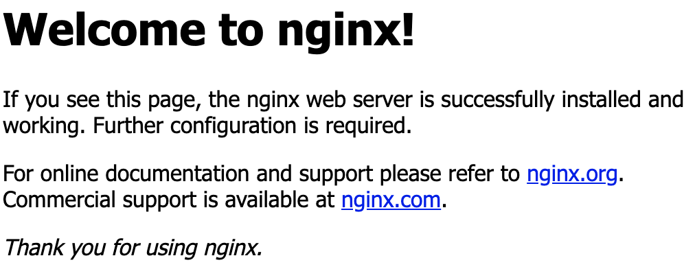

# Learn to manage your environment (Computer)

During this lecture, we will learn how to configure your local environment, with either Linux or MacOS. **Windows Users may use Ubuntu For Windows, which grants Linux abilities to a Windows Environment**.

- Use package managers to install specific system packages/libraries on your computer
- Configure a Web Server

# Installing system packages/libraries

Depending on your OS, you will have to use a specific way to install new system packets (for example, programming languages such as `php` or `node.js`, or Webservers like `apache` or `nginx`).

In this lecture, we will focus on both OS:
- Linux with Ubuntu
- MacOS

**For Windows Users, please download [Ubuntu For Windows](https://tutorials.ubuntu.com/tutorial/tutorial-ubuntu-on-windows)**, this way, you'll have access to a Linux OS on your Windows computer (No dual-boot needed).

## Requirements:

- FileSystem commands
- User and Permissions
- Shell Variables
- Addresses and Ports

## Package Managers

When we want to install a specific library on a computer/server, we will use a **Package Manager** most of the time.

Package Managers are applications (via Command Line) used to install specific libraries.
For example, if I want to install `php` on my laptop, I will use my laptop's OS Package Manager to install it.

## OS Specific Package Managers

### Debian Linux (Ubuntu, Debian...)

When you first install a Debian-Linux Distribution on your laptop like `Debian` or `Ubuntu`, the `APT` package manager is automatically installed, and you may use its Command Line Interface (CLI) to install specific packages.

Before installing any package with the `apt install` command described below, you have to update your system's apt cache with the following command:
```bash
apt update
```

```bash
apt install <package-name>

# For example, if I want to install `git` on my Debian system:
apt install git
```
**Note that you will need to run this command as the root user, you may do so by using the command sudo**:
```bash
# Sudo asks the system to become the root user (superadmin) to run the following command
sudo apt install git
```

Usually, when you want to install a specific package, you might search for it on your web browser: `install <package> ubuntu`. For example to install git, we'll type `install git ubuntu`, you will find the following result:


You can see that this link points to the official ubuntu website `doc.ubuntu-fr.org > git`.

On the website, you usually have an `Installation` section, describing the process to install `git` in the following example:


### MacOS

#### Installation

On MacOS, we may use a package manager called [Homebrew](https://brew.sh/index_fr), which you will have to install manually, to start using it.

As explained on [HomeBrew's official website](https://brew.sh/index_fr), you may run the following command to install:
```bash
/usr/bin/ruby -e "$(curl -fsSL https://raw.githubusercontent.com/Homebrew/install/master/install)"
```

Homebrew, like most of the available package managers on the  market, runs very similarly to `APT` (see above section for Linux): You can install softwares with the command:
```bash
brew install <package>
```

For example, to install the `php` programming language:
```bash
brew install php
```

To know which packages you may install with HomeBrew, please [refer to the official package listing on Homebrew's website](https://formulae.brew.sh/formula/). For example, I searched for `php` in the search bar.

## The PATH system environment variable, and Shell profiles

### PATH

The PATH Environment Variable exists on `Linux`, `MacOS` and `Windows`. This system variable is used to reference the directories inside your File System in which your system will be looking to run specific programs.

For example, let's say I type the following command:
```bash
git status
```
My system will be looking for a program (a file) called `git` in my File System, and execute it with the argument `status`. My system found the `git` program (file) because it looked inside my `PATH` environment variable, and then searched for `git` inside every directories inside my PATH variable.

You may see the content of your PATH variable by running the following command:
```bash
echo $PATH
# In my case, it prints the following output
/bin:/usr/bin:/usr/local/bin:/usr/sbin:.........
```
It means that when I run a program/command, my system will be looking in the directories specified inside my `PATH` (delimited with `:`) variable to search for the program, from the left to the right (if the PATH variable holds the following value: `/bin:/usr/bin:/usr/local/bin:/usr/sbin`):
- /bin
- /usr/bin
- /usr/local/bin
- /usr/sbin

When the system finds the program, it stops searching for it, which means it will not be looking inside the next directories. This means that you may have multiple programs called `git` inside your `PATH`, but only the first one to be found will be executed.

You can check which program file has been executed with the following command:
```bash
which git
# In my case, it prints the following output
/usr/bin/git
```
The command `which` looks inside your `PATH` variable and prints the first program it finds with the given name (here, `git`).

**On Windows, please refer [to this link](https://docs.alfresco.com/4.2/tasks/fot-addpath.html) to see how to modify your PATH**.

**On MacOS and Linux, you may update the PATH variable inside your Shell Profile files (in next section)**.

### Shell Profiles

Shell Profiles are `files` that your Shell application (`bash`, `zsh`) will read when initializing a new session. We can use these files to define specific configuration, like updating the `PATH` system variable for example.

Depending on your Shell Application:
- `bash` (usually the default one): `.bash_profile` file inside your home/user repository
- `zsh` (if you installed OhMyZSH for example): `.zshrc` file inside your home/user repository.

**To know which shell you are currently using: run the following command**:
```bash
echo $SHELL
# In my case, as I am using ZSH with OhMyZSH:
/bin/zsh
```

When you want to update your `PATH` environment variable to add another directory, so when you run a command, your system will look for the program inside this directory, you may add the following line inside your `profile` file (.bash_profile or .zshrc):
```bash
export PATH="$PATH:/path/to/directory"
# "$PATH:/path/to/directory" means add the content inside $PATH variable, and concatenate a string ":/path/to/directory" to it
```

**Please Note that when you update the file, your Shell Session does not know it has been modified, so you need to reload the shell profile inside your shell session, with the command `source`:**
```bash
source .bash_profile
# Or
source .zshrc
```

## TP - Install your first package: node.js

The goal of this exercice is to install your first package, the `node.js` runtime, which allows you to run JavaScript programs inside your Terminal (and on Back-end Servers).

- On MacOS: [Check HomeBrew's official website](https://formulae.brew.sh/formula)
- On Linux: check for `install node.js ubuntu` in your web-browser, or you can search for `nodejs` on [Ubuntu's official website](https://doc.ubuntu-fr.org/).
- On Windows (if you DO NOT want to use Ubuntu For Windows): Download it on [Node.js official website](https://nodejs.org/en/) (I would recommend you to go with Ubuntu For Windows, as we will work a lot with Linux in these courses).

Once you installed node.js on your laptop, you can check that it is installed properly by running the following command:
```bash
node --version
# should display the version of node js you installed (example: v10.13.0)
```

To run `node.js` programs (like you probably do in your Algorythm lectures):
- create a file and start writing your JavaScript code, for example:
  ```javascript
  // Create a file 'hello.js', and write the following content
  console.log('Hello, Node.js');
  ```
- Run the node.js runtime to execute your program, written in your `hello.js` file:
  ```bash
  node hello.js
  # Prints the following
  Hello, Node.js
  ```

Now you can start writing your first programs with node.js, we used this package to illustrate how to install a package on your laptop, now we will install other packages such as `php`, `mysql` and `apache` as you will be using these packages during your backend course, with Aymeric Mayeux, and you will need to understand how your environment works, and how to set it up.

## TP: Install PHP

You will need to install PHP for Backend courses later in the semester. You will learn how to do it right now, during this exercise.

PHP may be installed via:
- `apt` on Linux (and Windows running Ubuntu For Windows)
- `homebrew` on MacOS

### Ubuntu (and Windows via Ubuntu For Windows)

**On Ubuntu (and Windows via Ubuntu for Windows), you will have to install a package called `php-cli`**. (Many other PHP packages are available, and we will install these ones later on, but right now we only need PHP running as a Command Line Interface => `CLI`).

Once you installed `php-cli` package, you may test your installation by running the following command:

```bash
php --version
```

### MacOS (with HomeBrew)

On MacOS, the PHP language should already be installed, but we will install the latest version in this exercise.

If the following command runs properly, it means that php is already installed on your laptop.
```bash
php --version
# On my Computer, it produces the following output
PHP 7.1.23 (cli) (built: Feb 22 2019 22:19:32) ( NTS )
Copyright (c) 1997-2018 The PHP Group
Zend Engine v3.1.0, Copyright (c) 1998-2018 Zend Technologies
```

To know where PHP is installed, run:
```bash
which php
# it should output the path to the default version of php already installed on your laptop
/usr/bin/php
```

**On MacOS, please refer to [the official php brew package](https://formulae.brew.sh/formula/php#default)**.

Now that you installed a newer version of PHP on your computer, you will have to override the already installed one (which will be used by default if you do not override).

For example, run the command:
```bash
which php
# It should output the same path as before: the default version installed on your computer
/usr/bin/php
```
If you see the same path as previously, it means that all `php commands` you will run in the futur will use the old php program, instead of the new one you just installed. In order to override this behaviour, we will create an `alias`.

**Open your Shell Profile file (either .zshrc or .bash_profile depending on your `echo $SHELL` output like explained above), at the bottom of the file, add the following line:
```bash
alias php="/usr/local/bin/php"
```

**Don't forget to reload the shell profile with command `source` like explained in above Section Shell Profiles**.

Now if you run the command:
```bash
which php
# Should output
/usr/local/bin/php
```

And the php version should match the latest one we just installed:
```bash
php --version
# Output
PHP 7.3.11 (cli) (built: Oct 24 2019 11:29:52) ( NTS )
Copyright (c) 1997-2018 The PHP Group
Zend Engine v3.3.11, Copyright (c) 1998-2018 Zend Technologies
    with Zend OPcache v7.3.11, Copyright (c) 1999-2018, by Zend Technologies
```

Congratulations, you just installed PHP and updated your Shell Profile to use the latest version.

# Work With Web Servers (NGINX)

The Web uses the network Protocol `HTTP` (over `TCP`) as its main communication protocol. It means that when you open `www.google.com` in your Web Browser, your browser application (Mozilla Firefox, Google Chrome, Internet Explorer...) sends a request (via the protocol `HTTP`) to the server (computer) behind `www.google.com`, which treats the request and sends back a response, displayed in your Web Browser.

In order to serve a Website on the Internet, we need to use an application which handles `HTTP requests`, and return a response. The response will contain our `HTML page` (in case of a simple Website). Until now, you have been running your Web applications (.html files) in your browser, which understands the HTML Markup language, and display elements.

A Web Server allows your browser to `ask` for the .html page, the Web Server then sends the content of the .html file, your browser receives it and displays graphic elements.

Later in the semester, you will start `Backend Courses` (PHP, MySQL), and you will need a Web Server Application to execute PHP Code, and send back responses to your clients (a Web Page, with dynamic content, for example a list of `posts` if you develop a Blog).

You should have installed `php` on your computer during last Execise. With PHP, you may run a basic web server with the following command:
```bash
php -S <network-interface>:<port>
# Do not worry about network interface and Port, we will talk about that during the lecture
```
**You Should place yourself in a directory with html files (with cd) before running the command above**.

For example:
```bash
# Create a directory called my-first-server
mkdir my-first-server
cd my-first-server
# Create a file index.html and add a h1
echo '<h1>Hello World</h1>' > index.html
# Staret a php server
php -S localhost:8000
```

In your Web Browser, open the link http://localhost:8000, you should see your title with the content `Hello, World`.
You just ran your first Web Server with PHP, on your computer (`localhost` means run on your computer), on your network PORT 8000.

When you will deploy your websites, you should not use PHP's WebServer as it does not offer great performances (Not built for production). Instead, you should use Web Servers like [NGINX](https://www.nginx.com/) or the older [Apache](https://httpd.apache.org/).

## TP: Install and configure nginx

In this exercise, we will learn how to install and configure one of the most-used Web Server on the market: [NGINX](https://www.nginx.com/).

Install via:
- [Linux/Ubuntu](https://doc.ubuntu-fr.org/nginx)
- [MacOS via HomeBrew](https://formulae.brew.sh/formula/nginx#default)

### Part 1: Install nginx

#### Linux/Ubuntu

Once you installed nginx with the `apt` command, you may check if the service is running with the following command:
```bash
systemctl status nginx
# Should output the following content
● nginx.service - A high performance web server and a reverse proxy server
   Loaded: loaded (/lib/systemd/system/nginx.service; enabled; vendor preset: enabled)
   Active: active (running) since Thu 2018-04-19 18:34:30 UTC; 1 years 6 months ago
 Main PID: 19193 (nginx)
    Tasks: 3
   Memory: 6.4M
      CPU: 59min 45.552s
   CGroup: /system.slice/nginx.service
           ├─ 5638 nginx: worker process
           ├─ 5639 nginx: worker process
           └─19193 nginx: master process /usr/sbin/nginx -g daemon on; master_process on
```
The mention `Active: active (running)` means that your Web Server is running properly: Open your web browser and go to the address http://localhost:80, you should see the default nginx page:


With Linux, `nginx`'s configuration is located inside `/etc/nginx/nginx.conf`. You can see the content of this file with the command:
```bash
cat /etc/nginx/nginx.conf
```

#### On MacOS

To check that your nginx service is running, run the following command:
```bash
sudo brew services list
# should output sommething like the following
Name  Status  User Plist
nginx stopped
php   stopped
```
If Nginx is `stopped`, you  may start it using the command:
```bash
sudo brew services start nginx
```

Now, you should see nginx running:
```bash
sudo brew services list
# Should output something like this
Name  Status  User Plist
nginx started root /Library/LaunchDaemons/homebrew.mxcl.nginx.plist
php   stopped
```

Open your browser, use the address `localhost:8080`, you should see the default nginx page:


With MacOS, `nginx`'s configuration is located inside `/usr/local/etc/nginx/nginx.conf`. In your terminal, you can check the content of this file:
```bash
cat /usr/local/etc/nginx/nginx.conf
```

### Part 2: Configure NGINX

We will see how to configure nginx to serve a specific folder of HTML files, to serve a website.

Inside the nginx configuration file:
- MacOS:
  - `/usr/local/etc/nginx/nginx.conf`
- Linux:
  - `/etc/nginx/nginx.conf`: Main Configuration File
  - `/etc/nginx/sites-enabled/default`: Base Webserver configuration file

We will focus on different important directives on the `server` configuration:
```bash
server {
        listen       8080;
        server_name  localhost;

        location / {
            root   html;
            index  index.html index.htm;
        }

        error_page   500 502 503 504  /50x.html;
        location = /50x.html {
            root   html;
        }
    }
```
- `listen <port>`: on which port of your computer the nginx server should listen for connections
- `location`:
  - `root`: The root of your webserver inside your file system, for example if you want to serve files inside `/home/myuser` (an index.html for example), you may change the configuration to: `root /home/myuser;`.

In this exercise, we will configure NGINX Web server to manage your "Semaine Intensive d'Intégration".

This way, you'll get used to basic Web Server features, and how to configure it.

For this exercise, you will have to:
- Clone last week's project on your computer
- Configure NGINX's `root` to point on your project's directory (on your computer)
- Configure NGINX `port` (`listen`) to use port 81.
- Restart NGINX service to apply configuration:
  - `sudo brew services restart nginx` on MacOS
  - `sudo systemctl restart nginx` on Linux
- Open your web browser on http://localhost:81, you should see your website if everything went well.

### Part 3: Virtual Hosts

A Web Server like `nginx` may handle multiple websites, above we worked on how to configure a simple `server` directive inside nginx's configuration to serve a specific directory, on a specific port.

To serve multiple websites on the same nginx server, we will have to use `virtual hosts`. A Virtual Host is just a normal `nginx` configuration file, pointing to a specific directory on your computer, on a given PORT. We will add a specific attribute, to tell nginx in which case we want to use this configuration: the `server_name`.

For example, if you want to handle two sites `test.com` (HTML files located in /home/user/test) and `testing.com` (HTML files located in /home/user/testing) behind the same `nginx server`, you can use two virtual hosts (two distincts configuration files):
- One for `server_name: test.com`, with `root: /home/user/test` to serve HTML/CSS files from /home/user/test
- One for `server_name: testing.com`, with `root: /home/user/testing` to serve HTML/CSS files from /home/user/testing

When your nginx webserver receives a request for `http://test.com`, it will automatically load the file for test.com, the same goes for testing.com.

For example, we could have the following configuration file for virtual host `test.com`:
```conf
server {
  # On which port our application will listen
  listen 80;
  
  # For which Domain name this configuration is valid
  server_name: test.com;

  # Document root: Where the HTML/CSS files are located
  root /home/user/test;

  # Which file to use as default page when opening website
  # Here, we use index.html as default
  index index.html;
}
```

**Todo**

### Part PHP

**On Linux, you will have to install the package [php-fpm](https://doc.ubuntu-fr.org/php) before going on**. On MacOS, php-fpm is already installed when you install php via homebrew.

In order to execute PHP code, we will have to go through multiple steps:
- configure `php-fpm`, set `cgi.fix_pathinfo=0`:
  - `/etc/php-fpm/php.ini` on Linux
  - `/usr/local/etc/php/7.4/php.ini` on MacOS
  - Don't forget to restart your service:
    - `sudo service php-fpm restart` on Linux
    - `sudo brew services restart php` on Mac
- configure nginx (like we did in above exercise) to use `fastcgi` (php-fpm) to read files (PHP and HTML code).

Here is an example nginx configuration file to use `php-fpm` to execute PHP code on the server:
```conf
server {
  listen 8080;

  # Directory in which my .html/.php files are located
  root /Users/antoinemasselot/my-first-server;

  # Files to use as index on the server: index.php first
  index index.php index.html;

  # Update "location /" to "location ~ \.php" to handle connections to php files
  location ~ \.php$ {

      # try_files: Try to read a file called from URL, 
      # example:  http://localhost:8080/test.php will try to read a file "test.php"
      # if the file does not exist, web server will return a 404 not found error
      try_files $uri =404;

      # fastcgi_pass: where the php-fpm server is running (here, on my local computer on port 9000)
      # by default: PHP-FPM listens on 9000
      fastcgi_pass   127.0.0.1:9000;

      # fastcgi_index: used for PHP to read the default file if nothing is provided (just like index)
      # example: http://localhost:8080 => PHP reads index.php defined by this attribute
      fastcgi_index  index.php;

      # fascgi_param SCRIPT_FILENAME: Open php file
      fastcgi_param SCRIPT_FILENAME $document_root$fastcgi_script_name;

      include        fastcgi_params;
  }
}
```

<!-- ## TP: Install PHP, MySQL and Apache

### Introduction

In this Exercise, you will install and configure multiple system packages on your computer:
- `PHP`: Programming language, mostly used for Web Development (Backend/Server-side code).
- `MySQL`: Database Engine, we use MySQL to store data for your application, and will access MySQL Databases inside our server-side code, written with PHP in this case.
- `Apache (WebServer)`: In order to execute your PHP code on a Website, we need an application called `WebServer` to execute your programs (written in PHP in our case) and render informations inside a WebBrowser.

**Please Note that this is not a back-end class, but a system one, so we only talk a little bit about the usage of each of these packages, because you will learn how to write code during your back-end classes**.

Each of these packages is available on Linux (via `apt`), MacOS (via `homebrew`) and Windows. -->

