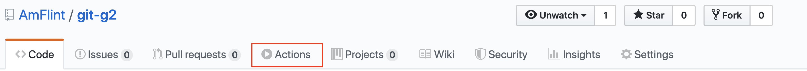
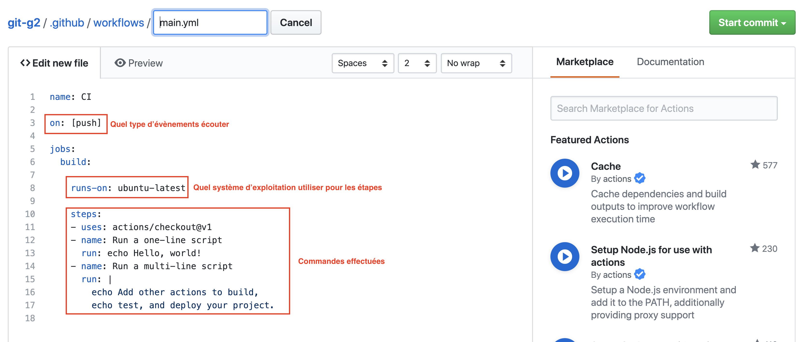

# TP: Déployez votre premier site web, sur un serveur

Dans ce TP, vous allez apprendre:
- Connexion à un serveur distant avec le protocole SSH (Secure SHell)
- Configurer un serveur web
- Automatiser le déploiement de votre site web

Cela vous permettra de mieux comprendre ce qu'il se passe sur netlify lorsque vous "pushez" sur la branche master.

**Utilisez votre projet de semaine intensive d'intégration**.

## Introduction

Dans ce TP, je vais vous fournir un serveur sur lequel vous pourrez vous connecter avec le protocole SSH pour l'administrer: Configurer NGINX, intéragir avec le système de fichier (vous créer un dossier), uploader le code source de votre site web, puis par la suite écrire un script d'automatisation du déploiement du site web.

J'ai au préalable configuré un serveur Linux (Ubuntu 18.04) pour que chaque étudiant puisse se connecter sur un utilisateur. Chaque étudiant devra se connecter à un utilisateur `nom-prenom`, par exemple pour moi: `masselot-antoine` (vous verrez dans la suite du TP).

## Pré-requis

- [Installer sshpass](https://gist.github.com/arunoda/7790979) (servira pour la partie bonus: automatisation):
  - `sudo apt install sshpass` sur Linux
  - `brew install https://raw.githubusercontent.com/kadwanev/bigboybrew/master/Library/Formula/sshpass.rb` sur MacOS

## Se connecter à un serveur distant avec SSH

Afin d'administrer un serveur distant, on peut utiliser le protocole SSH (Secure SHell), qui nous permet d'établir une session shell avec un ordinateur distant à travers le réseau. Une session Shell veut dire que l'on pourra se connecter au serveur, et lancer des commandes Shell (par exemple, cd, mkdir, cp, ls, rm, apt install, apt update, vim ...).

Pour ce faire, nous utiliserons la commande `ssh`, qui se décompose comme suit:
```bash
# <user>: l'utilisateur sur lequel on souhaite se connecter sur le serveur distant
# <host>: Hôte (adresse IP ou Nom de Domaine) du serveur
ssh <user>@<host>

# Avec les données de ce tp:
ssh <nom-prenom>@163.172.130.135
# Soit par exemple pour moi:
ssh masselot-antoine@163.172.130.135
# Le serveur vous demandera ensuite le mot de passe, tapez le mdp et appuyez sur la touche "entrer"
masselot-antoine@163.172.130.135's password:
```

**Très important pour la partie `automatisation`: On peut utiliser le flag `-t` pour passer une commande à effectuer, sans avoir à se connecter**:
```bash
# Ici, j'ouvre une connexion avec le serveur, je lance la commande ls /, et je ferme directement la connexion en une seule commande
ssh masselot-antoine@163.172.130.135 -t ls /
```

Petit bémol de la commande `ssh`, le mot de passe vous sera demandé à nouveau, vous pouvez en revanche utiliser la commande `sshpass` pour contourner le problème (vous verrez dans les étapes à suivre, au niveau du script d'automatisation):
```bash
# sshpass permet de passer le mot de passe en argument, puis de se connecter au serveur et exécuter une commande. Tout cela en une seule commande
sshpass -p <le-mot-de-passe> ssh masselot-antoine@163.172.130.135 -t ls /
```


## Configurer le serveur Web NGINX

Dans ce TP, un même serveur Linux est partagé entre tous les étudiants, et chacun se connecte sur son propre utilisateur, avec son dossier de session dans `/home/<nom-prenom>` (par exemple `/home/masselot-antoine`).

- Tout d'abord, créez un dossier `site` dans lequel vous allez ajouter un fichier `index.html` avec du contenu. Par la suite, nous uploaderons le contenu de votre site web depuis votre ordinateur, dans ce dossier. Et nous allons configurer le serveur web pour ouvrir les fichiers de ce dossier `site`.

- Étant donné que tout le monde partage le même serveur Linux, j'ai installé le serveur web nginx, et je l'ai configuré pour utiliser les fichiers de configuration dans le dossier `nginx` de chacun des étudiants (par exemple `/home/masselot-antoine/nginx`). Vous devrez donc créer un fichier de configuration nginx pour votre site dans le dossier `nginx` de votre session. 
Je vous conseille d'utiliser le fichier de configuration par défaut donné par nginx, puis modifiez le ensuite en fonction de votre besoin:
  ```bash
  # Je me trouve dans mon dossier utilisateur: /home/masselot-antoine
  # Je rentre dans le dossier nginx
  cd nginx

  # Je peux copier le fichier default d'nginx pour écrire ma configuration dans mon dossier "nginx"
  cp /etc/nginx/sites-enabled/default masselot-antoine
  ```
  **Dans ce fichier, vous devrez impérativement modifier les attributs**:
  - `root`: Pointe sur votre dossier (par exemple pour moi `/home/masselot-antoine/site`)
  - `server_name`: Nom de domaine pour lequel la configuration sera appliquée. **Le server_name doit être sous le format `nom-prenom.netlify.masselab.com`,** par exemple `masselot-antoine.netlify.masselab.com`. Ensuite, notifiez moi pour que je puisse créer le nom de domaine en question.
  - `listen 80;`: écouter sur le port 80 du serveur (vérifiez bien que la mention `default_server` n'est pas présente)
  - `index`: préciser le fichier `index.html`


**Pour vérifier que la configuration d'NGINX est correct avant de relancer le service, lancez la commande suivante**:
```bash
# -t pour "tester" la syntaxe des fichiers de configuration
# sudo pour exécuter la commande en tant qu'administrateur: root
sudo nginx -t
```

**N'oubliez pas de relancer le service nginx pour appliquer votre configuration** (uniquement lorsque vous modifiez la configuration nginx, pas à chaque modification du code du site):
```bash
sudo service nginx restart
```

## Uploader des fichiers de votre ordinateur vers un serveur distant

Maintenant, vous aurez besoins de prendre votre site, et de l'envoyer sur le serveur, pour ce faire, vous pourrez utiliser la commande `scp`:
```bash
# Commande générique
# -r permet d'uploader un dossier et son contenu, sans le -r, la commande scp cherche à uploader un seul fichier et ne fonctionnera pas avec un dossier (le dossier contenant votre site)
scp -r /chemin/vers/dossier/du/site <utilisateur>@<hôte>:/chemin/sur/instance

# La commande suivante est chargée d'uploader tous les fichiers (et dossiers) dans le dossier dans lequel je me trouve
# sur la machine avec l'IP 163.172.130.135 en tant qu'utilisateur "masselot-antoine"
# à l'emplacement /home/masselot-antoine/site
scp -r * masselot-antoine@163.172.130.135:/home/masselot-antoine/site
# Évidemment, vous devrez taper votre mot de passe
```

Vérifiez bien que votre site a été copié au bon endroit sur le serveur, vous pourrez évidemment vous assurer que le serveur web NGINX sert votre site correctement en vous connectant sur le site http://nom-prenom.netlify.masselab.com (remplacez nom-prenom par votre nom et prénom).

## Automatisation du déploiement du site

Une fois votre site en ligne, nous allons travailler sur un `script shell`, pour automatiser la mise à jours de celui ci sur le serveur, en une seule commande.

En gros, nous allons écrire une suite de commande dans un fichier, puis l'exécuter pour lancer toutes ces commandes. Parmis ces commandes, on voudra uploader le contenu de notre site (mis à jours) sur le serveur avec les commandes `sshpass` et `scp`.

Pour écrire un script Shell, il suffit simplement de créer un fichier (par convention, on utilisera l'extension `.sh`: shell):
```bash
# créer un fichier monscript.sh
touch monscript.sh
```

Vous pouvez évidemment créer ce fichier depuis votre éditeur de texte préféré.

À l'intérieur du fichier, on pourra écrire des commandes shells, par exemple:
```bash
ls /
mkdir test-script
touch test-script/test-fichier
```

Ici, ce script va:
- afficher les fichiers/dossiers dans le dossier `/` dans notre terminal
- créer un dossier `test-script`
- créer un fichier `test-fichier` dans le dossier `test-script`

Pour exécuter le script, on lancera la commande `bash`:
```bash
# Exécuter le fichier monscript.sh
bash monscript.sh
```

Pour cette partie, vous devrez créer le script shell dans le dossier contenant votre site web.

À l'exécution du script, le contenu de votre dossier (dans lequel se trouve votre site web) doit être uploadé sur le serveur donné, dans votre dossier personnel, ce qui mettra à jours le contenu de votre site web (puisque le serveur web va lire les fichiers présents dans votre dossier personnel).

**L'idée: On écrit un script shell contenant les commandes nécessaires pour déployer le site (mettre en ligne une nouvelle version), on va ensuite le commit sur notre repository Git, afin que tous les membres du groupe (de project) puisse récupérer le script et l'utiliser**.

Pour la partie Bonus, nous n'utiliserons pas ce script, mais plutôt les Github Actions, en spécifiant les commandes une par une, sans passer par un script shell.

## Bonus: Automatisation du déploiement au push sur Github

Il nous manque à présent une étape: exécuter le script de déploiement du site web, lorsque l'on push sur le projet sur Github. Après cette étape, nous aurons toute la chaîne effectuée par `Netlify`.

Pour cela, nous allons regarder les `Github Actions`, sorties très récemment: [Voir la documentation](https://github.com/features/actions).

Avec Github Actions, on peut ajouter des évènements sur un repository publié sur GitHub, comme par exemple `au push sur la branche master`, ou `lorsqu'une Pull Request est ouverte`.

On va ensuite pouvoir définir une liste d'actions à effectuer, notamment des commandes `shell`. Ces actions seront déclenchées lorsqu'un évènement est publié (`push sur master` par exemple).

Pour commencer à travailler avec les Github actions, il faudra au préable créer un nouveau repository sur GitHub, puis aller dans l'onglet `Actions`:
.

Vous pourrez ensuite créer un workflow (bouton en haut à droite pour passer à la configuration du workflow).

Une action est définie de la façon suivante:

- On définie dans quelles circonstances ce workflow sera déclenché (dans cet exemple, à tous les `push` sur toutes les branches)
- Sur quel système d'exploitation les commandes seront effectuées, ici on va utiliser le défaut: `ubuntu-latest` (Ubuntu Linux)
- Les étapes à effectuer, on peut spécifier d'autres actions, ou encore des commandes Shell.

**Notez que la première étape `actions/checkout@v1` est nécessaire: Elle sert à télécharger votre code dans le workflow, pour pouvoir effectuer des actions dessus (comme par exemple l'uploader sur votre serveur), comme Netlify**.

L'objectif est simple: Sur chaque push sur la branche `master`: déployer le contenu du site.

On peut donc imaginer un scénario similaire au scénario suivant:
```yml
name: Deploy Website

# Déclencher le workflow uniquement au push sur la branche master (ou lorsqu'une Pull Request est mergée dans master)
on:
  push:
    branches:
      - master

jobs:
  build:
    runs-on: ubuntu-latest
    steps:
      - uses: actions/checkout@v1
      - name: Deploy my website
        run: # des commandes pour déployer le site
```

Pour que la commande `scp` fonctionne correctement, vous aurez besoins d'effectuer une étape avant d'uploader votre code sur le serveur.

Rappelez vous la première fois que vous avez tenté de vous connecter en `ssh` au serveur fournis dans le TP: on vous a demandé si vous acceptiez la connexion à la machine. Ce processus se déclenche la première fois qu'on essaie de se connecter à un hôte distant avec le protocole SSH, et va donc arriver dans votre action.

**Vous devrez donc au préalable exécuter une commande pour autoriser la connexion en SSH avec scp au serveur**. On peut le faire avec la commande suivante:
```bash
# Créer le dossier .ssh pour notre utilisateur (~/ veut dire le dossier de l'utilisateur sur lequel on est connecté)
# C'est dans ce dossier que se trouve la configuration des hôtes autorisés avec SSH
mkdir ~/.ssh

# La commande ssh-keyscan permet de scanner une connexion avec le serveur donné
# On redirige ensuite la sortie de cette commande vers le fichier "known_hosts". C'est dans ce fichier que le programme SSH va regarder pour établir une connexion avec un hôte vérifié.
ssh-keyscan 163.172.130.135 >> ~/.ssh/known_hosts


# On peut ensuite déployer notre site
# Ici, de déploie mon site dans le dossier que j'ai crée précédemment pour ce TP: masselot-antoine
sshpass -p <password> scp -r * masselot-antoine@163.172.130.135:/home/masselot-antoine/site
```

Vous pouvez bien évidemment utiliser ces commandes directement dans votre Github Action, n'oubliez pas d'installer sshpass au préalable (non installée par défault):
```bash
sudo apt update && sudo apt install -y sshpass
```

Vous pouvez définir vos étapes dans le fichier de workflow Github Actions:
```yml
# ......

steps:
  - uses: actions/checkout@v1
  - name: Install SSHPASS
    run: sudo apt update && sudo apt install -y sshpass
  - name: Create .ssh directory
    run: mkdir ~/.ssh
  # ...
```

### Correction

Dans cette correction, voici le fichier de configuration de la Github Action que l'on utilise pour automatiquement déployer notre site web lorsqu'on push sur la branche master:
```yml
name: CI

on:
  push:
    branches: 
      - master

jobs:
  build:

    runs-on: ubuntu-latest

    steps:
    - uses: actions/checkout@v1
    - name: Install ssh pass
      run: sudo apt update && sudo apt install -y sshpass
    - name: create .ssh directory
      run: mkdir ~/.ssh
    - name: Verify Host via SSH
      run: ssh-keyscan 163.172.130.135 >> ~/.ssh/known_hosts
    - name: Deploy website
      run: sshpass -p <password> scp -r * masselot-antoine@163.172.130.135:/home/masselot-antoine/site
```

**Notez que le système actuel possède une faille de sécurité: on passe le mot de passe écrit en clair**. On peut utiliser un système de secret avec Github Actions, ce qui nous permet de définir le mot de passe dans la configuration de notre repository (`settings`), et d'utiliser la valeur de ce secret dans notre action, sans divulguer le mot de passe.

Pour résoudre ça:
- Aller dans l'onglet `Settings` (ou `paramètres`) de votre répository sur Github
- Dans l'onglet `Secrets` (sur la barre à gauche)
- Créer un nouveau secret: `SSHPASS`, et mettez le contenu de votre mot de passe.
- Remplacez dans votre action, la commande de déploiement par la commande suivante:
  ```yml
  # ...
  - name: Deploy website
    # L'option "-e" permet de spécifier que l'on souhaite utiliser la variable d'environnement nommée SSHPASS contenant notre mot de passe
    run: sshpass -e scp -r * masselot-antoine@163.172.130.135:/home/masselot-antoine/site
    env:
      # utilise le secret crée précédemment pour injecter une variable d'environnement appelé SSHPASS
      SSHPASS: ${{ secrets.SSHPASS }}
  ```
Ainsi, plus aucun problème de sécurité, votre code ne divulgue pas de mot de passe, puisqu'il utilise un `secret`, qui lui est spécifié dans la configuration de votre repository, chiffré.
